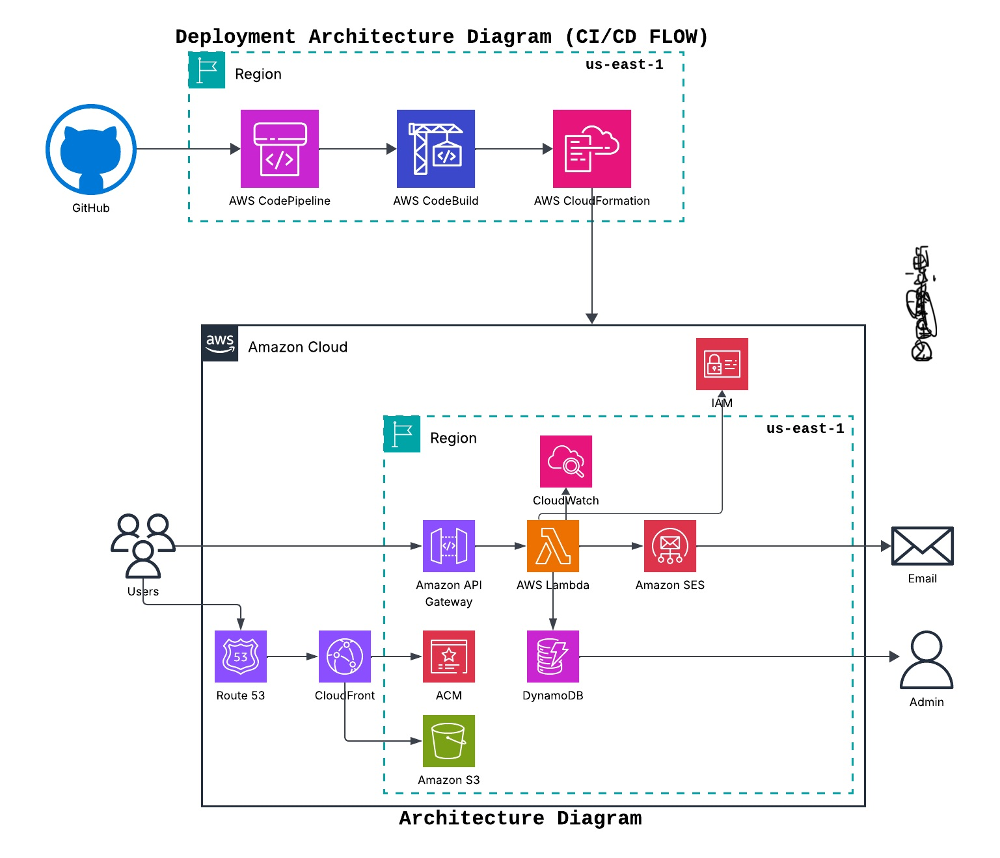
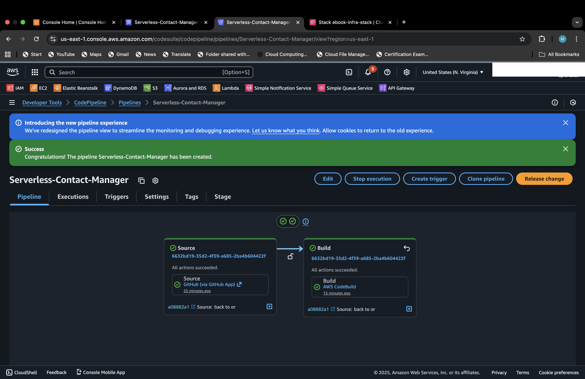

## SERVERLESS CONTACT MANAGEMENT SYSTEM AND EBOOK APPLICATION

## INTRO

This is a fully **serverless and automated** architecture intended to enable users to download ebooks. For every download, the administrator receives a notification with the user's contact details, and these details are saved for analysis and can be retrieved by the administrator at any time.

## ARCHITECTURE OVERVIEW

This application is deployed on **Amazon S3** with public access blocked and a **Bucket Policy** configured to only allow **CloudFront** access to the bucket content. The serverless backend utilizes **AWS Lambda and API Gateway**. **IAM Roles** are essential, enabling Lambda to access services like **SES** for sending download notifications to the admin and **DynamoDB** for storing user details. CloudFront delivers this application globally for **low latency**, backed by **AWS Certificate Manager (ACM)** for **HTTPS security** and **Route 53** for site delivery using a custom domain.

When a user downloads an ebook, an API call is made to the backend, which triggers the Lambda function. The Lambda function sends an email notification to the application administrator using SES and securely collects and stores the user's data in DynamoDB for analytical purposes.




## CHALLENGES:

My goal was a **fully automated deployment** with zero manual configuration using **CI/CD (CodePipeline/CodeBuild)**. **AWS CodeBuild** proved to be the major challenge during deployment. I encountered a series of failures, primarily due to incorrect **IAM policy configuration**. Even after attaching an IAM role, the deployment still failed because of **missing specific permissions** (the principle of least privilege required close scrutiny). The other challenge was the **strictness of YAML**. I had to meticulously rewrite the `buildspec.yml` to ensure precise indentation and structure, granting only the necessary permissions for deployment.

## RESULT

I successfully achieved a fully serverless and automated architecture for a contact management system, overcoming multiple deployment errors. I followed best practices, prioritizing security from start to finish. This project reinforced the critical need for attention to detail when configuring Automation templates (YAML) and IAM Policies across all AWS services.


## Tech Stacks

- **AWS Services:** S3, CloudFront, AWS Certificate Manager (ACM), Route 53, API Gateway (HTTP), Lambda, SES, DynamoDB, CloudWatch, CodePipeline, CodeBuild, CloudFormation, IAM
- **Tools:** AWS CLI, Git, GitHub

## Deployment

1. Initialize and publish the source code to GitHub. The deployment uses two primary files: the CloudFormation template `contact.yaml` and the build specification file `buildspec.yml`.

**Note**: The `buildspec.yml` file must be in the root of your repository, and static content (HTML, CSS, JS) should be organized in a sub-folder.

2. Create a CodeBuild Project.
- Use GitHub as the source provider
- Use an existing service role or create a new one if you don't have any.
- Use a buildspec file `buildspec.yml`
- You can leave other things as default if your using the AWS console but if you are using AWS CLI, you'll need to create a Json file defining your project structure and then pass that file to the CLI.
EXAMPLE:

``` bash 
aws codebuild create-project --cli-input-json file://codebuild-config.json
```
i.e if your Json file is named codebuild-config.json

3. Create a custom Pipeline.
- Choose GitHub as the source and ensure your github account is connected to AWS if not create the connection and give access to the repository you want to use as source.
- Choose an existing role or create a new one
- Use the configured CodeBuild Project created above for the Build stage
- Skip the Test stage and skip the Deploy stage, as CodeBuild will handle the final deployment actions.

4. **Pipeline Execution:** Once the CodePipeline is created, it automatically triggers CodeBuild. After CloudFormation successfully creates all resources, the CodeBuild project will:

- Fetch CloudFormation Outputs: Retrieve important dynamic values (e.g., S3 Bucket Name, CloudFront Distribution ID, and API Gateway URL).
- Inject API Endpoint: Automatically inject the created API endpoint URL into the static frontend files `index.html` and `contact.html`.
- Upload Content: Upload the modified static contents to the created S3 bucket.
- Invalidate Cache: Invalidate CloudFront to ensure users immediately load the updated content.

5. Once this is done, test the application using the custom domain name and the site will load and you can test out the other functionalities.



## Understanding the CloudFormation Template

Here is a brief rundown of the Resources created in `contact.yaml` and why.

1. **S3Bucket and BucketPolicy**: An S3 Bucket serves the static web application content. The Bucket Policy secures the content by blocking all public access and only granting access to CloudFront.

2. **CloudFront**: A cloudfront distribution was created as the global entry point to fetch the static content from S3 and deliver the application securly and globally with **low latency**.

3. **Amazon Certificate Manager**: An ACM was requested, and linked to cloudfront to **enforce HTTPS traffic** for added security.

4. **Route 53**: A hosted zone was created to manage the custom domain and the application traffic from cloudfront was pointed to this domian.

4. **SES**: An email identity is created and verified to handle administrator notifications upon every ebook download.

5. **DynamoDB**: Used to securely collect and store user contact details for analytical purposes.

6. **Lambda**: Two functions are deployed:
- **Function 1 (POST)**: Handles SES notification and the collection/storage of user data upon download.
- **Function 2 (GET)**: Handles the secure retrieval of user data for administrative access.

7. **API Gateway**: An HTTP API is created to act as the publicly exposed interface that triggers the Lambda functions.

8. **IAM**: An IAM Role with least privilege is assigned to Lambda, granting access to SES, DynamoDB (PutItem and Scan), and CloudWatch Logs for monitoring.


## Understanding the Buildspec Template

The `buildspec.yml` served as the instruction manual for the CodeBuild project:

1. **CloudFormation Deployment**: It is in charge of deploying the CloudFormation stack (contact.yaml). The deployment is conditional, with an exception coded to prevent deployment when no changes are detected.

Note: its important to add this exception below if not, codebuild will keep trying to auto deploy the stack after every update.

``` bash
--no-fail-on-empty-changeset || echo "No changes detected."
```

2. **Output Fetching**: After the CloudFormation stack is successfully deployed, the buildspec fetches important dynamic outputs (like the S3 Bucket Name, CloudFront Distribution ID, and API URL).

3. **Frontend Injection**: The template uses the fetched outputs to dynamically inject the live API endpoint URL into the static HTML/JS files.

4. **S3 Upload**: It uploads the entire static content directory with the updated and live API URL to the newly created S3 bucket.

5. **Cache Invalidation**: Finally, it invalidates the CloudFront cache, ensuring all users receive the newly deployed site files immediately.

[Watch the CodeBuild Success Log Demo Here](https://drive.google.com/file/d/1BZlv2-83RL8ooVJAq36ojCk0XC5sW6k6/view?usp=drivesdk)
